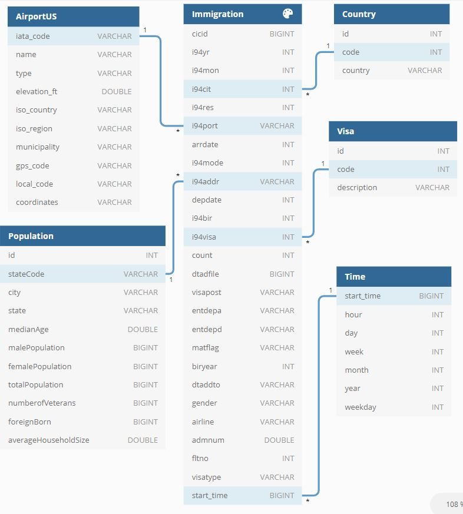
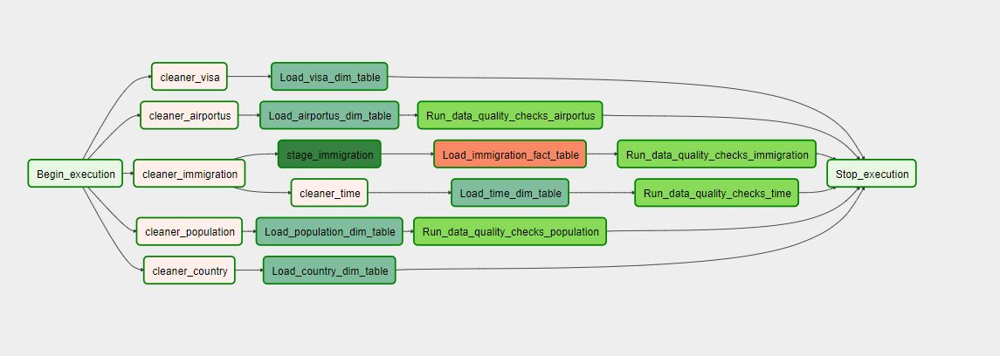

# Udacity-project-us-immigrant
The project consists of creating an ETL for the 2016 immigration data warehouse. Considering the demographics and airports of the US.

### Data.

***Immigration datasets***: This data comes from the US National Tourism and Trade Office. This report contains international visitor arrival statistics by world regions and selected countries (including the top 20), visa type, mode of transport, age groups, states visited (only the first expected address) and the main ports of entry (for selected countries). This information corresponds to 2016.

A sample of this files is:
```
,cicid,i94yr,i94mon,i94cit,i94res,i94port,arrdate,i94mode,i94addr,depdate,i94bir,i94visa,count,dtadfile,visapost,occup,entdepa,entdepd,entdepu,matflag,biryear,dtaddto,gender,insnum,airline,admnum,fltno,visatype
2027561,4084316.0,2016.0,4.0,209.0,209.0,HHW,20566.0,1.0,HI,20573.0,61.0,2.0,1.0,20160422,,,G,O,,M,1955.0,07202016,F,,JL,56582674633.0,00782,WT
2171295,4422636.0,2016.0,4.0,582.0,582.0,MCA,20567.0,1.0,TX,20568.0,26.0,2.0,1.0,20160423,MTR,,G,R,,M,1990.0,10222016,M,,*GA,94361995930.0,XBLNG,B2
589494,1195600.0,2016.0,4.0,148.0,112.0,OGG,20551.0,1.0,FL,20571.0,76.0,2.0,1.0,20160407,,,G,O,,M,1940.0,07052016,M,,LH,55780468433.0,00464,WT
```

***Airport-codes datasets***: This information comes from datahub.io and contains the list of all airport codes, the attributes are identified in the description of the data package. Some of the columns contain attributes that identify the airport locations, other codes (IATA, local if any) that are relevant for identifying an airport.

A sample of this files is:
```
ident,type,name,elevation_ft,continent,iso_country,iso_region,municipality,gps_code,iata_code,local_code,coordinates
00A,heliport,Total Rf Heliport,11,NA,US,US-PA,Bensalem,00A,,00A,"-74.93360137939453, 40.07080078125"
00AA,small_airport,Aero B Ranch Airport,3435,NA,US,US-KS,Leoti,00AA,,00AA,"-101.473911, 38.704022"
00AK,small_airport,Lowell Field,450,NA,US,US-AK,Anchor Point,00AK,,00AK,"-151.695999146, 59.94919968"
```

***Us-cities-demographic datasets***: This dataset contains information about the demographics of all US cities and census-designated places with a population greater or equal to 65,000. This data comes from the US Census Bureau's 2015 American Community Survey.

A sample of this files is:
```
City;State;Median Age;Male Population;Female Population;Total Population;Number of Veterans;Foreign-born;Average Household Size;State Code;Race;Count
Silver Spring;Maryland;33.8;40601;41862;82463;1562;30908;2.6;MD;Hispanic or Latino;25924
Quincy;Massachusetts;41.0;44129;49500;93629;4147;32935;2.39;MA;White;58723
Hoover;Alabama;38.5;38040;46799;84839;4819;8229;2.58;AL;Asian;4759
Rancho Cucamonga;California;34.5;88127;87105;175232;5821;33878;3.18;CA;Black or African-American;24437
```

***Countries.csv datasets***: The static_data/COUNTRIES.csv file is built, containing the country identifiers. This information is obtained from the file I94_SAS_Labels_Descriptions.SAS

A sample of this files is:
```
ID;COUNTRY
582;MEXICO Air Sea, and Not Reported (I-94, no land arrivals)
236;AFGHANISTAN
101;ALBANIA
316;ALGERIA
```

***Visa.csv datasets***: The static_data/VISA.csv file is built, containing the visa identifiers. This information is obtained from the file I94_SAS_Labels_Descriptions.SAS
```
ID;DESCRIPTION
1;Business
2;Pleasure
3;Student
```

## Conceptual Data Model


## Airflow DAG


## Project structure

This structure that is described is in the airflow directory:

* ***dags***: Directory containing the dags.

* ***dags/etl_immigration_udacity.py***: Contains the operators for the ETL.

* ***plugins/operators***: Contains custom operators.
	* ***stage_redshift.py***: Defines the StageToRedshiftOperator operator that is responsible for copying the parquet data from the udacity s3 bucket to the redshift cluster stage table
    * ***load_dimension.py***: Defines the LoadDimensionOperator operator. It is responsible for reading the stage table and generating the dimensions.
    * ***load_fact.py***: Defines the LoadFactOperator operator is responsible for reading the stage table and generating the facts table
    * ***data_quality.py***: Defines the operator DataQualityOperator is responsible for validating if the data was inserted correctly.

* ***static_data***: This directory contains the csv files that is extracted from the I94_SAS_Labels_Descriptions.SAS file.
* ***images***: This directory contains the project images.
* ***create_tables.py***: File containing the logic to generate the snowflake model.
* ***sql_queries.py***: Contains the SQL statements to generate the model.
* ***requeriment.txt***: Contains the project libraries.
* ***Capstone Project Template.ipynb***: The file contains the step by step of how the data was analyzed.
* ***README.md***: This file contains the description of the project.

### Prerequisites
* Airflow 1.10.10
* AWS credentials.
* Conda (Python 3.7).
* Cluster Amazon Redshift.
* Bucket S3.
* Spark-2.4.3
* Fill in the **dl.cfg** configuration file 
* Register aws credentials in airflow with Conn Id **aws_credentials**
* Register the redshift credentials in airflow with the Conn Id **redshift**

### Installing.

1. Set the variables in the **dl.cfg**.
    * ***AWS_ACCESS_KEY_ID***: Aws access key 
    * ***AWS_SECRET_ACCESS_KEY***: Aws secret key 
    * ***AWS_REGION***: Aws region
    * ***BUCKET_S3***: Bucket s3 output
    * ***BUCKET_S3A***: s3a://example/
    * ***BUCKET_S3***: s3://exaample/
    * ***PATH_WORKSPACE***: path root project.
    * ***PATH_SAS***: path file SAS
    * ***HOST***: Host redshift
    * ***DB_NAME***: Database redshift
    * ***DB_USER***: User redshift.
    * ***DB_PASSWORD***: Password redshift.
    * ***DB_PORT***: Port redshift
    * ***ARN***: IAM_ROLE

2. Register the aws credentials in Airflow connections with the name **aws_credentials**

3. Register the redshift credentials in Airflow connections with the name **redshift**

4. Create a cluster in redshift and run **create_tables.py** only once.

> `python create_tables.py; echo $?`

***If the program ends with 0 it was executed correctly.***

## Running the tests

Run the airflow job etl_immigration_udacity

Validate that the DAG terminates successfully.

## Authors

* **Jose Marquez** - [Github](https://github.com/jmarquez42)